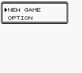
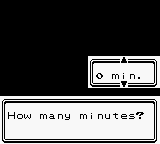
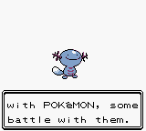
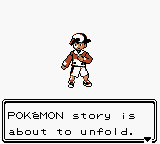

## Turn 1
Thoughts:
>No thoughts so far, just placeholders.

Button:  
`A`

Memory:
```json
{
  "head": "empty"
}
```

Screenshots:

 

## Turn 2
Thoughts:
>Hmm, it looks like I've just started a new game of Pokémon Crystal. So far I've only pressed the 'A' button, so I don't have much to go on yet. The screenshot shows a grassy landscape with some trees in the background, but no Pokémon or other characters are visible. My next step should be to explore the area, talk to any NPCs I come across, and try to advance the story or find my first Pokémon. I'll need to pay close attention to the details in the environment and any text or dialogue that appears, as that will likely provide important clues about what I should do next.

Button:  
`A`

Memory:
```json
{
  "head": "empty"
}
```

Screenshots:

 

## Turn 3
Thoughts:
>Okay, it looks like I've just started a new game of Pokémon Crystal. In the first turn, I pressed the 'A' button which likely triggered the start of the game. The screenshot shows a grassy landscape with some trees in the background, but no Pokémon or other characters are visible. For the next step, I should explore the area, talk to any NPCs I come across, and try to advance the story or find my first Pokémon. I'll need to pay close attention to the details in the environment and any text or dialogue that appears, as that will likely provide important clues about what I should do next.

Button:  
`A`

Memory:
```json
{
  "head": "empty"
}
```

Screenshots:

 

## Turn 4
Thoughts:
>Looks like I've just started a new game of Pokémon Crystal. The most recent screenshot shows a character select screen that asks 'Are you a boy? Or are you a girl?'. This is a common introductory sequence in Pokémon games, where the player selects their character's gender at the start of the game. Since I've already pressed the 'A' button a few times, it seems I've already made that selection, but the game is now clearly prompting me to choose between being a boy or a girl protagonist. I should select the option that best suits the playthrough I want to have, considering factors like my personal preference, potential advantages or disadvantages of each gender, or any specific goals I may have for this particular save file. Once I make that choice, the game will likely proceed to the next stage of the introductory sequence, where I'll be able to further customize my character and begin my Pokémon adventure.

Button:  
`A`

Memory:
```json
{
  "head": "new game",
  "gender_selected": null,
  "current_location": "character select screen",
  "goals": [
    "Advance the story",
    "Obtain my first Pok\u00e9mon",
    "Explore the game world and talk to NPCs"
  ],
  "lessons_learned": []
}
```

Screenshots:

 

## Turn 5
Thoughts:
>Hmm, it looks like I've just finished the character selection process and the game has now moved on to a screen where I can enter my character's name. This is a common next step in Pokémon games, where the player gets to customize their protagonist's identity. I should carefully consider what name I want to give my character, as it will be the name they are referred to throughout the entire game. Since this is the start of a new playthrough, I may want to choose a name that has personal significance or aligns with the type of character I want to roleplay as. Once I've entered the name I'm satisfied with, I can press the 'A' button to confirm it and proceed to the next part of the introductory sequence, where the game will likely introduce me to the world of Pokémon and set me on my journey.

Button:  
`A`

Memory:
```json
{
  "head": "new game",
  "gender_selected": null,
  "current_location": "name entry screen",
  "goals": [
    "Advance the story",
    "Obtain my first Pok\u00e9mon",
    "Explore the game world and talk to NPCs"
  ],
  "lessons_learned": []
}
```

Screenshots:

 

## Turn 6
Thoughts:
>The last screenshot shows a mysterious text message that appears to be from an unknown sender. It says 'Zzz... Hm? Mha...? You woke me up!' This is likely a cryptic message from some kind of in-game character or entity, possibly a Pokémon, that has been awakened by my actions. Since I'm just starting a new game, I don't have any context for who or what this could be referring to yet. My next step should be to investigate further, talk to any NPCs I can find, and try to uncover the meaning behind this strange message. It may provide an important clue or lead me towards my next objective in the game's story. I'll need to remain observant and open-minded as I progress, as unexplained occurrences like this often play a significant role in a Pokémon adventure.

Button:  
`A`

Memory:
```json
{
  "head": "new game",
  "gender_selected": null,
  "current_location": "name entry screen",
  "goals": [
    "Advance the story",
    "Obtain my first Pok\u00e9mon",
    "Explore the game world and talk to NPCs"
  ],
  "lessons_learned": [
    "Pay close attention to environmental details and dialogue, as they provide important clues",
    "Carefully consider character customization choices, as they can impact the playthrough"
  ]
}
```

Screenshots:

 

## Turn 7
Thoughts:
>Hmm, this cryptic message about being woken up is certainly intriguing. It seems like some kind of supernatural or mysterious element has been introduced right at the start of my Pokémon Crystal adventure. My next step should be to continue pressing forward, talking to any NPCs I encounter, and trying to uncover more information about this strange occurrence. I'll need to stay alert and observant, as clues about the meaning behind this message may start to surface as I progress through the game's story. For now, I'll press the 'A' button to see what happens next, and hopefully get some more context about this unusual situation.

Button:  
`A`

Memory:
```json
{
  "head": "new game",
  "gender_selected": null,
  "current_location": "name entry screen",
  "goals": [
    "Advance the story",
    "Obtain my first Pok\u00e9mon",
    "Explore the game world and talk to NPCs"
  ],
  "lessons_learned": [
    "Pay close attention to environmental details and dialogue, as they provide important clues",
    "Carefully consider character customization choices, as they can impact the playthrough",
    "Unexplained occurrences and cryptic messages may hold significant meaning, so it's important to investigate them further"
  ]
}
```

Screenshots:

 

## Turn 8
Thoughts:
>The latest screenshot shows a clock or time display, indicating that the game has progressed to a specific in-game day and time. This suggests that some time has passed since the strange, cryptic message I encountered earlier. Now I should focus on exploring my surroundings, talking to NPCs, and seeing if I can gather any more information or clues about the significance of that previous message. Paying close attention to environmental details and dialogue will be crucial, as they may provide important context about what's happening in the world of Pokémon Crystal. I'll press the 'A' button to see what unfolds next and continue advancing the story.

Button:  
`A`

Memory:
```json
{
  "head": "new game",
  "gender_selected": null,
  "current_location": "name entry screen",
  "goals": [
    "Advance the story",
    "Obtain my first Pok\u00e9mon",
    "Explore the game world and talk to NPCs"
  ],
  "lessons_learned": [
    "Pay close attention to environmental details and dialogue, as they provide important clues",
    "Carefully consider character customization choices, as they can impact the playthrough",
    "Unexplained occurrences and cryptic messages may hold significant meaning, so it's important to investigate them further"
  ]
}
```

Screenshots:

 

## Turn 9
Thoughts:
>The latest screenshot shows a confirmation prompt asking 'What!? DAY 10 o'clock?' This seems to be a continuation of the time-related events I encountered earlier. I should carefully consider my response, as it may have consequences for the story or my progress in the game.

Button:  
`YES`

Memory:
```json
{
  "head": "new game",
  "gender_selected": null,
  "current_location": "name entry screen",
  "goals": [
    "Advance the story",
    "Obtain my first Pok\u00e9mon",
    "Explore the game world and talk to NPCs"
  ],
  "lessons_learned": [
    "Pay close attention to environmental details and dialogue, as they provide important clues",
    "Carefully consider character customization choices, as they can impact the playthrough",
    "Unexplained occurrences and cryptic messages may hold significant meaning, so it's important to investigate them further"
  ]
}
```

Screenshots:

 

## Turn 10
Thoughts:
>The confirmation prompt about the time seems significant, so I should carefully consider my response. I'll press the 'A' button to select 'YES' and see what happens next.

Button:  
`A`

Memory:
```json
{
  "head": "new game",
  "gender_selected": null,
  "current_location": "time confirmation screen",
  "goals": [
    "Advance the story",
    "Obtain my first Pok\u00e9mon",
    "Explore the game world and talk to NPCs"
  ],
  "lessons_learned": [
    "Pay close attention to environmental details and dialogue, as they provide important clues",
    "Carefully consider character customization choices, as they can impact the playthrough",
    "Unexplained occurrences and cryptic messages may hold significant meaning, so it's important to investigate them further"
  ]
}
```

Screenshots:

 

## Turn 11
Thoughts:
>The time-related confirmations suggest something unusual is happening in the game world. I should carefully continue to explore and gather more information to uncover the significance of these events.

Button:  
`A`

Memory:
```json
{
  "head": "new game",
  "gender_selected": null,
  "current_location": "time confirmation screen",
  "goals": [
    "Advance the story",
    "Obtain my first Pok\u00e9mon",
    "Explore the game world and talk to NPCs"
  ],
  "lessons_learned": [
    "Pay close attention to environmental details and dialogue, as they provide important clues",
    "Carefully consider character customization choices, as they can impact the playthrough",
    "Unexplained occurrences and cryptic messages may hold significant meaning, so it's important to investigate them further"
  ]
}
```

Screenshots:

 

## Turn 12
Thoughts:
>The time-related confirmations are becoming increasingly bizarre. I should press 'A' to select 'YES' and see what unfolds next, as this may provide important context about the strange occurrences I've encountered so far in this new Pokémon Crystal adventure.

Button:  
`A`

Memory:
```json
{
  "head": "new game",
  "gender_selected": null,
  "current_location": "time confirmation screen",
  "goals": [
    "Advance the story",
    "Obtain my first Pok\u00e9mon",
    "Explore the game world and talk to NPCs"
  ],
  "lessons_learned": [
    "Pay close attention to environmental details and dialogue, as they provide important clues",
    "Carefully consider character customization choices, as they can impact the playthrough",
    "Unexplained occurrences and cryptic messages may hold significant meaning, so it's important to investigate them further"
  ]
}
```

Screenshots:

 

## Turn 13
Thoughts:
>The time-related events have taken an even more unusual turn, with the game now confirming 'DAY 10:00? I overslept!'. This suggests some sort of significant time disturbance or unnatural occurrence in the game world. I should continue pressing 'A' to see how this unfolds, as it may provide crucial context about the larger mystery I've encountered at the start of this new Pokémon Crystal playthrough.

Button:  
`A`

Memory:
```json
{
  "head": "new game",
  "gender_selected": null,
  "current_location": "time confirmation screen",
  "goals": [
    "Advance the story",
    "Obtain my first Pok\u00e9mon",
    "Explore the game world and talk to NPCs"
  ],
  "lessons_learned": [
    "Pay close attention to environmental details and dialogue, as they provide important clues",
    "Carefully consider character customization choices, as they can impact the playthrough",
    "Unexplained occurrences and cryptic messages may hold significant meaning, so it's important to investigate them further"
  ]
}
```

Screenshots:

 

## Turn 14
Thoughts:
>The strange time-related events I've encountered suggest some kind of unusual disturbance or mystery in the Pokémon world. The latest screenshot shows a character apologizing for keeping me waiting, which implies I may have been caught up in this time anomaly. I should continue investigating this further by talking to any NPCs I can find and trying to uncover more context about what's going on.

Button:  
`A`

Memory:
```json
{
  "head": "new game",
  "gender_selected": null,
  "current_location": "unexplained time disturbance",
  "goals": [
    "Advance the story",
    "Obtain my first Pok\u00e9mon",
    "Explore the game world and talk to NPCs",
    "Investigate the strange time-related events and uncover their significance"
  ],
  "lessons_learned": [
    "Pay close attention to environmental details and dialogue, as they provide important clues",
    "Carefully consider character customization choices, as they can impact the playthrough",
    "Unexplained occurrences and cryptic messages may hold significant meaning, so it's important to investigate them further",
    "Time-related anomalies and disturbances seem to be a central focus of the current situation, so I should prioritize uncovering more information about them"
  ]
}
```

Screenshots:

 

## Turn 15
Thoughts:
>It seems I've been caught up in a strange time-related disturbance in the Pokémon world. The game is hinting at some kind of unusual event or mystery unfolding, so I should continue exploring, talking to NPCs, and gathering more information to uncover the significance of these time anomalies.

Button:  
`A`

Memory:
```json
{
  "head": "new game",
  "gender_selected": null,
  "current_location": "unexplained time disturbance",
  "goals": [
    "Advance the story",
    "Obtain my first Pok\u00e9mon",
    "Explore the game world and talk to NPCs",
    "Investigate the strange time-related events and uncover their significance"
  ],
  "lessons_learned": [
    "Pay close attention to environmental details and dialogue, as they provide important clues",
    "Carefully consider character customization choices, as they can impact the playthrough",
    "Unexplained occurrences and cryptic messages may hold significant meaning, so it's important to investigate them further",
    "Time-related anomalies and disturbances seem to be a central focus of the current situation, so I should prioritize uncovering more information about them"
  ]
}
```

Screenshots:

 

## Turn 16
Thoughts:
>The introduction to this new Pokémon Crystal game has taken an interesting turn, with unexplained time disturbances and a mysterious character apologizing for keeping me waiting. I'll need to continue exploring the world, talking to NPCs, and uncovering more clues about the significance of these strange occurrences.

Button:  
`A`

Memory:
```json
{
  "head": "new game",
  "gender_selected": null,
  "current_location": "unexplained time disturbance",
  "goals": [
    "Advance the story",
    "Obtain my first Pok\u00e9mon",
    "Explore the game world and talk to NPCs",
    "Investigate the strange time-related events and uncover their significance"
  ],
  "lessons_learned": [
    "Pay close attention to environmental details and dialogue, as they provide important clues",
    "Carefully consider character customization choices, as they can impact the playthrough",
    "Unexplained occurrences and cryptic messages may hold significant meaning, so it's important to investigate them further",
    "Time-related anomalies and disturbances seem to be a central focus of the current situation, so I should prioritize uncovering more information about them"
  ]
}
```

Screenshots:

 

## Turn 17
Thoughts:
>It seems I've been introduced to a strange, time-related mystery at the start of my Pokémon Crystal adventure. The game is hinting at some sort of unusual event or disturbance, so I should continue exploring, talking to NPCs, and uncovering more clues to unravel the significance of these time anomalies.

Button:  
`A`

Memory:
```json
{
  "head": "new game",
  "gender_selected": null,
  "current_location": "unexplained time disturbance",
  "goals": [
    "Advance the story",
    "Obtain my first Pok\u00e9mon",
    "Explore the game world and talk to NPCs",
    "Investigate the strange time-related events and uncover their significance"
  ],
  "lessons_learned": [
    "Pay close attention to environmental details and dialogue, as they provide important clues",
    "Carefully consider character customization choices, as they can impact the playthrough",
    "Unexplained occurrences and cryptic messages may hold significant meaning, so it's important to investigate them further",
    "Time-related anomalies and disturbances seem to be a central focus of the current situation, so I should prioritize uncovering more information about them"
  ]
}
```

Screenshots:

 

## Turn 18
Thoughts:
>The strange time-related disturbances and mysterious NPCs suggest I've encountered a significant event or mystery at the start of my Pokémon Crystal adventure. I should continue investigating this further by exploring the world, talking to as many NPCs as possible, and trying to uncover more clues about the underlying significance of these unusual occurrences.

Button:  
`A`

Memory:
```json
{
  "head": "new game",
  "gender_selected": null,
  "current_location": "unexplained time disturbance",
  "goals": [
    "Advance the story",
    "Obtain my first Pok\u00e9mon",
    "Explore the game world and talk to NPCs",
    "Investigate the strange time-related events and uncover their significance"
  ],
  "lessons_learned": [
    "Pay close attention to environmental details and dialogue, as they provide important clues",
    "Carefully consider character customization choices, as they can impact the playthrough",
    "Unexplained occurrences and cryptic messages may hold significant meaning, so it's important to investigate them further",
    "Time-related anomalies and disturbances seem to be a central focus of the current situation, so I should prioritize uncovering more information about them"
  ]
}
```

Screenshots:

 

## Turn 19
Thoughts:
>The time-related disturbances and cryptic messages I've encountered suggest a significant mystery or event unfolding in the Pokémon world. I should continue exploring, talking to NPCs, and gathering more clues to uncover the meaning behind these unusual occurrences.

Button:  
`A`

Memory:
```json
{
  "head": "new game",
  "gender_selected": null,
  "current_location": "unexplained time disturbance",
  "goals": [
    "Advance the story",
    "Obtain my first Pok\u00e9mon",
    "Explore the game world and talk to NPCs",
    "Investigate the strange time-related events and uncover their significance"
  ],
  "lessons_learned": [
    "Pay close attention to environmental details and dialogue, as they provide important clues",
    "Unexplained occurrences and cryptic messages may hold significant meaning, so it's important to investigate them further",
    "Time-related anomalies and disturbances seem to be a central focus of the current situation, so I should prioritize uncovering more information about them"
  ]
}
```

Screenshots:

 

## Turn 20
Thoughts:
>The time-related anomalies and cryptic messages indicate a significant mystery or event unfolding in the Pokémon world. I should continue exploring, talking to NPCs, and gathering more clues to uncover the meaning behind these unusual occurrences.

Button:  
`A`

Memory:
```json
{
  "head": "new game",
  "gender_selected": null,
  "current_location": "unexplained time disturbance",
  "goals": [
    "Advance the story",
    "Obtain my first Pok\u00e9mon",
    "Explore the game world and talk to NPCs",
    "Investigate the strange time-related events and uncover their significance"
  ],
  "lessons_learned": [
    "Pay close attention to environmental details and dialogue, as they provide important clues",
    "Unexplained occurrences and cryptic messages may hold significant meaning, so it's important to investigate them further",
    "Time-related anomalies and disturbances seem to be a central focus of the current situation, so I should prioritize uncovering more information about them"
  ]
}
```

Screenshots:

 

## Turn 21
Thoughts:
>The time-related disturbances and mysterious entities suggest a significant event or mystery at the heart of this Pokémon Crystal adventure. I should continue exploring, talking to NPCs, and uncovering more clues to unravel the meaning behind these unusual occurrences.

Button:  
`A`

Memory:
```json
{
  "head": "new game",
  "gender_selected": null,
  "current_location": "unexplained time disturbance",
  "goals": [
    "Advance the story",
    "Obtain my first Pok\u00e9mon",
    "Explore the game world and talk to NPCs",
    "Investigate the strange time-related events and uncover their significance"
  ],
  "lessons_learned": [
    "Pay close attention to environmental details and dialogue, as they provide important clues",
    "Unexplained occurrences and cryptic messages may hold significant meaning, so it's important to investigate them further",
    "Time-related anomalies and disturbances seem to be a central focus of the current situation, so I should prioritize uncovering more information about them"
  ]
}
```

Screenshots:

 

## Turn 22
Thoughts:
>The time-related anomalies and cryptic messages about 'creatures' and 'supporting each other' suggest I've encountered a significant mystery or event in the Pokémon world. I should continue exploring, talking to NPCs, and gathering more clues to uncover the deeper meaning behind these unusual occurrences.

Button:  
`A`

Memory:
```json
{
  "head": "new game",
  "gender_selected": null,
  "current_location": "unexplained time disturbance",
  "goals": [
    "Advance the story",
    "Obtain my first Pok\u00e9mon",
    "Explore the game world and talk to NPCs",
    "Investigate the strange time-related events and uncover their significance"
  ],
  "lessons_learned": [
    "Pay close attention to environmental details and dialogue, as they provide important clues",
    "Unexplained occurrences and cryptic messages may hold significant meaning, so it's important to investigate them further",
    "Time-related anomalies and disturbances seem to be a central focus of the current situation, so I should prioritize uncovering more information about them"
  ]
}
```

Screenshots:

 

## Turn 23
Thoughts:
>The time-related disturbances and references to Pokémon suggest I've stumbled upon a significant mystery or event in the Pokémon world. I should continue exploring, talking to NPCs, and gathering more clues to uncover the deeper meaning behind these unusual occurrences.

Button:  
`A`

Memory:
```json
{
  "head": "new game",
  "gender_selected": null,
  "current_location": "unexplained time disturbance",
  "goals": [
    "Advance the story",
    "Obtain my first Pok\u00e9mon",
    "Explore the game world and talk to NPCs",
    "Investigate the strange time-related events and uncover their significance"
  ],
  "lessons_learned": [
    "Pay close attention to environmental details and dialogue, as they provide important clues",
    "Unexplained occurrences and cryptic messages may hold significant meaning, so it's important to investigate them further",
    "Time-related anomalies and disturbances seem to be a central focus of the current situation, so I should prioritize uncovering more information about them"
  ]
}
```

Screenshots:

 

## Turn 24
Thoughts:
>The time-related anomalies and cryptic messages about Pokémon suggest I've encountered a significant story event or mystery in this Pokémon Crystal playthrough. I should continue exploring, talking to NPCs, and gathering more clues to uncover the deeper meaning behind these unusual occurrences.

Button:  
`A`

Memory:
```json
{
  "head": "New game",
  "gender_selected": null,
  "current_location": "Unexplained time disturbance",
  "goals": [
    "Advance the story",
    "Obtain my first Pok\u00e9mon",
    "Explore the game world and talk to NPCs",
    "Investigate the strange time-related events and uncover their significance"
  ],
  "lessons_learned": [
    "Pay close attention to environmental details and dialogue, as they provide important clues",
    "Unexplained occurrences and cryptic messages may hold significant meaning, so it's important to investigate them further",
    "Time-related anomalies and disturbances seem to be a central focus of the current situation, so I should prioritize uncovering more information about them"
  ]
}
```

Screenshots:

 

## Turn 25
Thoughts:
>The time disturbances and cryptic messages suggest a significant mystery or event unfolding in the Pokémon world. I should continue exploring, talking to NPCs, and gathering more clues to uncover the deeper meaning behind these unusual occurrences.

Button:  
`A`

Memory:
```json
{
  "head": "Unexplained time disturbance",
  "gender_selected": null,
  "current_location": "Unexplained time disturbance",
  "goals": [
    "Advance the story",
    "Obtain my first Pok\u00e9mon",
    "Explore the game world and talk to NPCs",
    "Investigate the strange time-related events and uncover their significance"
  ],
  "lessons_learned": [
    "Pay close attention to environmental details and dialogue, as they provide important clues",
    "Unexplained occurrences and cryptic messages may hold significant meaning, so it's important to investigate them further",
    "Time-related anomalies and disturbances seem to be a central focus of the current situation, so I should prioritize uncovering more information about them"
  ]
}
```

Screenshots:

 

## Turn 26
Thoughts:
>The strange time-related anomalies and cryptic messages I've encountered so far suggest a significant mystery or event unfolding in the Pokémon world. I should continue exploring, talking to NPCs, and gathering more clues to uncover the deeper meaning behind these unusual occurrences.

Button:  
`A`

Memory:
```json
{
  "head": "Unexplained time disturbance",
  "gender_selected": null,
  "current_location": "Unexplained time disturbance",
  "goals": [
    "Advance the story",
    "Obtain my first Pok\u00e9mon",
    "Explore the game world and talk to NPCs",
    "Investigate the strange time-related events and uncover their significance"
  ],
  "lessons_learned": [
    "Pay close attention to environmental details and dialogue, as they provide important clues",
    "Unexplained occurrences and cryptic messages may hold significant meaning, so it's important to investigate them further",
    "Time-related anomalies and disturbances seem to be a central focus of the current situation, so I should prioritize uncovering more information about them"
  ]
}
```

Screenshots:

 

## Turn 27
Thoughts:
>The time disturbances and cryptic references to 'Pokémon' and 'mysteries' suggest I'm caught up in a significant event or narrative in this Pokémon Crystal adventure. I should keep exploring, talking to NPCs, and gathering more clues to uncover the deeper meaning behind these unusual occurrences.

Button:  
`A`

Memory:
```json
{
  "head": "Unexplained time disturbance",
  "gender_selected": null,
  "current_location": "Unexplained time disturbance",
  "goals": [
    "Advance the story",
    "Obtain my first Pok\u00e9mon",
    "Explore the game world and talk to NPCs",
    "Investigate the strange time-related events and uncover their significance"
  ],
  "lessons_learned": [
    "Pay close attention to environmental details and dialogue, as they provide important clues",
    "Unexplained occurrences and cryptic messages may hold significant meaning, so it's important to investigate them further",
    "Time-related anomalies and disturbances seem to be a central focus of the current situation, so I should prioritize uncovering more information about them"
  ]
}
```

Screenshots:

 

## Turn 28
Thoughts:
>The time disturbances and cryptic messages about 'Pokémon' and 'mysteries' indicate I'm caught up in a significant narrative event. I should keep exploring, talking to NPCs, and gathering more clues to uncover the deeper meaning behind these unusual occurrences.

Button:  
`A`

Memory:
```json
{
  "head": "Unexplained time disturbance",
  "gender_selected": null,
  "current_location": "Unexplained time disturbance",
  "goals": [
    "Advance the story",
    "Obtain my first Pok\u00e9mon",
    "Explore the game world and talk to NPCs",
    "Investigate the strange time-related events and uncover their significance"
  ],
  "lessons_learned": [
    "Pay close attention to environmental details and dialogue, as they provide important clues",
    "Unexplained occurrences and cryptic messages may hold significant meaning, so it's important to investigate them further",
    "Time-related anomalies and disturbances seem to be a central focus of the current situation, so I should prioritize uncovering more information about them"
  ]
}
```

Screenshots:

 

## Turn 29
Thoughts:
>The time-related disturbances and mysterious references to Pokémon suggest I've stumbled upon a significant narrative event or mystery at the start of this Pokémon Crystal adventure. I should continue exploring, talking to NPCs, and gathering more clues to unravel the deeper meaning behind these unusual occurrences.

Button:  
`A`

Memory:
```json
{
  "head": "Unexplained time disturbance",
  "gender_selected": null,
  "current_location": "Unexplained time disturbance",
  "goals": [
    "Advance the story",
    "Obtain my first Pok\u00e9mon",
    "Explore the game world and talk to NPCs",
    "Investigate the strange time-related events and uncover their significance"
  ],
  "lessons_learned": [
    "Pay close attention to environmental details and dialogue, as they provide important clues",
    "Unexplained occurrences and cryptic messages may hold significant meaning, so it's important to investigate them further",
    "Time-related anomalies and disturbances seem to be a central focus of the current situation, so I should prioritize uncovering more information about them"
  ]
}
```

Screenshots:

 

## Turn 30
Thoughts:
>The time disturbances and introduction of my character's name suggest I'm about to begin my Pokémon adventure proper. I should continue exploring to learn more about this unusual situation and how it ties into the larger narrative.

Button:  
`A`

Memory:
```json
{
  "head": "Unexplained time disturbance",
  "gender_selected": null,
  "current_location": "Unexplained time disturbance",
  "goals": [
    "Advance the story",
    "Obtain my first Pok\u00e9mon",
    "Explore the game world and talk to NPCs",
    "Investigate the strange time-related events and uncover their significance"
  ],
  "lessons_learned": [
    "Pay close attention to environmental details and dialogue, as they provide important clues",
    "Unexplained occurrences and cryptic messages may hold significant meaning, so it's important to investigate them further",
    "Time-related anomalies and disturbances seem to be a central focus of the current situation, so I should prioritize uncovering more information about them"
  ]
}
```

Screenshots:

 

## Turn 31
Thoughts:
>It seems my character's name has been revealed, signaling the start of the proper Pokémon adventure. I should continue exploring and interacting with NPCs to learn more about the time disturbances and uncover the significance of this unusual situation.

Button:  
`A`

Memory:
```json
{
  "head": "Unexplained time disturbance",
  "gender_selected": null,
  "current_location": "Beginning of Pok\u00e9mon Crystal adventure",
  "goals": [
    "Advance the story",
    "Obtain my first Pok\u00e9mon",
    "Explore the game world and talk to NPCs",
    "Investigate the strange time-related events and uncover their significance"
  ],
  "lessons_learned": [
    "Pay close attention to environmental details and dialogue, as they provide important clues",
    "Unexplained occurrences and cryptic messages may hold significant meaning, so it's important to investigate them further",
    "Time-related anomalies and disturbances seem to be a central focus of the current situation, so I should prioritize uncovering more information about them"
  ]
}
```

Screenshots:

 

## Turn 32
Thoughts:
>The character introduction and name selection suggest I'm now ready to begin my proper journey in Pokémon Crystal. I should explore further, talk to NPCs, and continue uncovering clues about the mysterious time-related disturbances I've encountered so far.

Button:  
`A`

Memory:
```json
{
  "head": "Unexplained time disturbance",
  "gender_selected": null,
  "current_location": "Beginning of Pok\u00e9mon Crystal adventure",
  "goals": [
    "Advance the story",
    "Obtain my first Pok\u00e9mon",
    "Explore the game world and talk to NPCs",
    "Investigate the strange time-related events and uncover their significance"
  ],
  "lessons_learned": [
    "Pay close attention to environmental details and dialogue, as they provide important clues",
    "Unexplained occurrences and cryptic messages may hold significant meaning, so it's important to investigate them further",
    "Time-related anomalies and disturbances seem to be a central focus of the current situation, so I should prioritize uncovering more information about them"
  ]
}
```

Screenshots:

 

## Turn 33
Thoughts:
>The character introduction and name selection indicate I'm now ready to begin my Pokémon Crystal adventure in earnest. I should continue exploring, talking to NPCs, and gathering more clues about the mysterious time-related disturbances I've encountered so far to uncover their deeper significance.

Button:  
`A`

Memory:
```json
{
  "head": "Unexplained time disturbance",
  "gender_selected": null,
  "current_location": "Beginning of Pok\u00e9mon Crystal adventure",
  "goals": [
    "Advance the story",
    "Obtain my first Pok\u00e9mon",
    "Explore the game world and talk to NPCs",
    "Investigate the strange time-related events and uncover their significance"
  ],
  "lessons_learned": [
    "Pay close attention to environmental details and dialogue, as they provide important clues",
    "Unexplained occurrences and cryptic messages may hold significant meaning, so it's important to investigate them further",
    "Time-related anomalies and disturbances seem to be a central focus of the current situation, so I should prioritize uncovering more information about them"
  ]
}
```

Screenshots:

 

## Turn 34
Thoughts:
>The character introduction and name selection suggest I'm now ready to begin my Pokémon Crystal adventure in earnest. I should continue exploring, talking to NPCs, and gathering more clues about the mysterious time-related disturbances I've encountered so far to uncover their deeper significance.

Button:  
`A`

Memory:
```json
{
  "head": "Unexplained time disturbance",
  "gender_selected": null,
  "current_location": "Beginning of Pok\u00e9mon Crystal adventure",
  "goals": [
    "Advance the story",
    "Obtain my first Pok\u00e9mon",
    "Explore the game world and talk to NPCs",
    "Investigate the strange time-related events and uncover their significance"
  ],
  "lessons_learned": [
    "Pay close attention to environmental details and dialogue, as they provide important clues",
    "Unexplained occurrences and cryptic messages may hold significant meaning, so it's important to investigate them further",
    "Time-related anomalies and disturbances seem to be a central focus of the current situation, so I should prioritize uncovering more information about them"
  ]
}
```

Screenshots:

 

## Turn 35
Thoughts:
>With my character name now set, I'm ready to officially begin my Pokémon Crystal adventure. The time-related disturbances and cryptic messages suggest a deeper mystery unfolding, so I should continue exploring, talking to NPCs, and gathering more clues to unravel the significance of these unusual occurrences.

Button:  
`A`

Memory:
```json
{
  "head": "Unexplained time disturbance",
  "gender_selected": null,
  "current_location": "Beginning of Pok\u00e9mon Crystal adventure",
  "goals": [
    "Advance the story",
    "Obtain my first Pok\u00e9mon",
    "Explore the game world and talk to NPCs",
    "Investigate the strange time-related events and uncover their significance"
  ],
  "lessons_learned": [
    "Pay close attention to environmental details and dialogue, as they provide important clues",
    "Unexplained occurrences and cryptic messages may hold significant meaning, so it's important to investigate them further",
    "Time-related anomalies and disturbances seem to be a central focus of the current situation, so I should prioritize uncovering more information about them"
  ]
}
```

Screenshots:

 

## Turn 36
Thoughts:
>The character name selection and introduction signal the beginning of my Pokémon Crystal adventure. I should now focus on fully immersing myself in the game world, talking to NPCs, and uncovering more clues about the mysterious time-related disturbances to unravel their deeper significance.

Button:  
`A`

Memory:
```json
{
  "head": "Unexplained time disturbance",
  "gender_selected": null,
  "current_location": "Beginning of Pok\u00e9mon Crystal adventure",
  "goals": [
    "Advance the story",
    "Obtain my first Pok\u00e9mon",
    "Explore the game world and talk to NPCs",
    "Investigate the strange time-related events and uncover their significance"
  ],
  "lessons_learned": [
    "Pay close attention to environmental details and dialogue, as they provide important clues",
    "Unexplained occurrences and cryptic messages may hold significant meaning, so it's important to investigate them further",
    "Time-related anomalies and disturbances seem to be a central focus of the current situation, so I should prioritize uncovering more information about them"
  ]
}
```

Screenshots:

 

## Turn 37
Thoughts:
>With my character's name now set, I am ready to fully immerse myself in the Pokémon Crystal adventure. The time-related disturbances and cryptic messages suggest a deeper mystery unfolding, so I should continue exploring, talking to NPCs, and gathering more clues to unravel the significance of these unusual occurrences.

Button:  
`A`

Memory:
```json
{
  "head": "Unraveling the Pok\u00e9mon Crystal Mystery",
  "gender_selected": null,
  "current_location": "Beginning of Pok\u00e9mon Crystal adventure",
  "goals": [
    "Advance the main story narrative",
    "Obtain my first Pok\u00e9mon companion",
    "Explore the game world and interact with NPCs",
    "Investigate the strange time-related events and uncover their significance"
  ],
  "lessons_learned": [
    "Pay close attention to environmental details and dialogue, as they provide important clues",
    "Unexplained occurrences and cryptic messages may hold significant meaning, so it's important to investigate them further",
    "Time-related anomalies seem to be a central focus, so uncovering more information about them should be a priority"
  ]
}
```

Screenshots:

 

## Turn 38
Thoughts:
>The character name selection signals the official start of my Pokémon Crystal adventure. I should now focus on thoroughly exploring the game world, interacting with NPCs, and uncovering more clues about the mysterious time-related disturbances to unravel their deeper significance within the overall narrative.

Button:  
`A`

Memory:
```json
{
  "head": "Unraveling the Pok\u00e9mon Crystal Mystery",
  "gender_selected": null,
  "current_location": "Beginning of Pok\u00e9mon Crystal adventure",
  "goals": [
    "Advance the main story narrative",
    "Obtain my first Pok\u00e9mon companion",
    "Explore the game world and interact with NPCs",
    "Investigate the strange time-related events and uncover their significance"
  ],
  "lessons_learned": [
    "Pay close attention to environmental details and dialogue, as they provide important clues",
    "Unexplained occurrences and cryptic messages may hold significant meaning, so it's important to investigate them further",
    "Time-related anomalies seem to be a central focus, so uncovering more information about them should be a priority"
  ]
}
```

Screenshots:

 

## Turn 39
Thoughts:
>Now that I've officially begun my Pokémon Crystal adventure, I should thoroughly explore the game world, talk to NPCs, and gather more clues about the mysterious time-related disturbances I've encountered. These cryptic occurrences suggest a deeper narrative unfolding, which I'm eager to unravel.

Button:  
`A`

Memory:
```json
{
  "head": "Unraveling the Pok\u00e9mon Crystal Mystery",
  "gender_selected": null,
  "current_location": "Beginning of Pok\u00e9mon Crystal adventure",
  "goals": [
    "Advance the main story narrative",
    "Obtain my first Pok\u00e9mon companion",
    "Explore the game world and interact with NPCs",
    "Investigate the strange time-related events and uncover their significance"
  ],
  "lessons_learned": [
    "Pay close attention to environmental details and dialogue, as they provide important clues",
    "Unexplained occurrences and cryptic messages may hold significant meaning, so it's important to investigate them further",
    "Time-related anomalies seem to be a central focus, so uncovering more information about them should be a priority"
  ]
}
```

Screenshots:

 

## Turn 40
Thoughts:
>The character's name is finally revealed, signaling the start of my full Pokémon Crystal adventure. I should now focus on exploring the world, talking to NPCs, and uncovering more clues about the mysterious time-related disturbances to unravel the deeper significance behind these unusual occurrences.

Button:  
`A`

Memory:
```json
{
  "head": "Unraveling the Pok\u00e9mon Crystal Mystery",
  "gender_selected": null,
  "current_location": "Beginning of Pok\u00e9mon Crystal adventure",
  "goals": [
    "Advance the main story narrative",
    "Obtain my first Pok\u00e9mon companion",
    "Explore the game world and interact with NPCs",
    "Investigate the strange time-related events and uncover their significance"
  ],
  "lessons_learned": [
    "Pay close attention to environmental details and dialogue, as they provide important clues",
    "Unexplained occurrences and cryptic messages may hold significant meaning, so it's important to investigate them further",
    "Time-related anomalies seem to be a central focus, so uncovering more information about them should be a priority"
  ]
}
```

Screenshots:

 

## Turn 41
Thoughts:
>The game has now officially begun, and I am ready to dive into the Pokémon Crystal adventure. The mysterious time-related disturbances I've encountered suggest a deeper narrative unfolding, so I should continue exploring the world, interacting with NPCs, and gathering more clues to unravel the significance of these unusual occurrences.

Button:  
`A`

Memory:
```json
{
  "head": "Unraveling the Pok\u00e9mon Crystal Mystery",
  "gender_selected": null,
  "current_location": "Beginning of Pok\u00e9mon Crystal adventure",
  "goals": [
    "Advance the main story narrative",
    "Obtain my first Pok\u00e9mon companion",
    "Explore the game world and interact with NPCs",
    "Investigate the strange time-related events and uncover their significance"
  ],
  "lessons_learned": [
    "Pay close attention to environmental details and dialogue, as they provide important clues",
    "Unexplained occurrences and cryptic messages may hold significant meaning, so it's important to investigate them further",
    "Time-related anomalies seem to be a central focus, so uncovering more information about them should be a priority"
  ]
}
```

Screenshots:

 

## Turn 42
Thoughts:
>The time distortions and cryptic messages about Pokémon suggest I've stumbled upon a significant narrative event or mystery at the start of this adventure. I should continue exploring, talking to NPCs, and gathering more clues to uncover the deeper meaning behind these unusual occurrences.

Button:  
`A`

Memory:
```json
{
  "head": "Unraveling the Pok\u00e9mon Crystal Mystery",
  "gender_selected": null,
  "current_location": "Beginning of Pok\u00e9mon Crystal adventure",
  "goals": [
    "Advance the main story narrative",
    "Obtain my first Pok\u00e9mon companion",
    "Explore the game world and interact with NPCs",
    "Investigate the strange time-related events and uncover their significance"
  ],
  "lessons_learned": [
    "Pay close attention to environmental details and dialogue, as they provide important clues",
    "Unexplained occurrences and cryptic messages may hold significant meaning, so it's important to investigate them further",
    "Time-related anomalies seem to be a central focus, so uncovering more information about them should be a priority"
  ]
}
```

Screenshots:

 

## Turn 43
Thoughts:
>The time distortions and cryptic messages about Pokémon indicate I've encountered a significant narrative event or mystery at the start of this adventure. I should continue exploring, talking to NPCs, and gathering more clues to uncover the deeper meaning behind these unusual occurrences.

Button:  
`A`

Memory:
```json
{
  "head": "Unraveling the Pok\u00e9mon Crystal Mystery",
  "gender_selected": null,
  "current_location": "Beginning of Pok\u00e9mon Crystal adventure",
  "goals": [
    "Advance the main story narrative",
    "Obtain my first Pok\u00e9mon companion",
    "Explore the game world and interact with NPCs",
    "Investigate the strange time-related events and uncover their significance"
  ],
  "lessons_learned": [
    "Pay close attention to environmental details and dialogue, as they provide important clues",
    "Unexplained occurrences and cryptic messages may hold significant meaning, so it's important to investigate them further",
    "Time-related anomalies seem to be a central focus, so uncovering more information about them should be a priority"
  ]
}
```

Screenshots:

 

## Turn 44
Thoughts:
>The time distortions and references to Pokémon and challenges suggest I'm on the cusp of starting my adventure in earnest. I should remain diligent in exploring the world, talking to NPCs, and uncovering more clues to fully understand the significance of these unusual occurrences.

Button:  
`A`

Memory:
```json
{
  "head": "Unraveling the Pok\u00e9mon Crystal Mystery",
  "gender_selected": null,
  "current_location": "Beginning of Pok\u00e9mon Crystal adventure",
  "goals": [
    "Advance the main story narrative",
    "Obtain my first Pok\u00e9mon companion",
    "Explore the game world and interact with NPCs",
    "Investigate the strange time-related events and uncover their significance"
  ],
  "lessons_learned": [
    "Pay close attention to environmental details and dialogue, as they provide important clues",
    "Unexplained occurrences and cryptic messages may hold significant meaning, so it's important to investigate them further",
    "Time-related anomalies seem to be a central focus, so uncovering more information about them should be a priority"
  ]
}
```

Screenshots:

 

## Turn 45
Thoughts:
>The time distortions and cryptic references to Pokémon and a 'world of dreams and adventures' indicate I'm on the verge of embarking on a significant journey filled with mysteries and challenges. I should remain focused and continue exploring the game world, talking to NPCs, and gathering more clues to uncover the deeper meaning behind these unusual occurrences.

Button:  
`A`

Memory:
```json
{
  "head": "Unraveling the Pok\u00e9mon Crystal Mystery",
  "gender_selected": null,
  "current_location": "Beginning of Pok\u00e9mon Crystal adventure",
  "goals": [
    "Advance the main story narrative",
    "Obtain my first Pok\u00e9mon companion",
    "Explore the game world and interact with NPCs",
    "Investigate the strange time-related events and uncover their significance"
  ],
  "lessons_learned": [
    "Pay close attention to environmental details and dialogue, as they provide important clues",
    "Unexplained occurrences and cryptic messages may hold significant meaning, so it's important to investigate them further",
    "Time-related anomalies seem to be a central focus, so uncovering more information about them should be a priority"
  ]
}
```

Screenshots:

 

## Turn 46
Thoughts:
>The mention of 'Pokémon' and 'awaits' suggests I'm about to encounter my first Pokémon companion, which will be a crucial milestone in my adventure. I should prepare to make an important choice and explore this new development carefully.

Button:  
`A`

Memory:
```json
{
  "head": "Unraveling the Pok\u00e9mon Crystal Mystery",
  "gender_selected": null,
  "current_location": "Beginning of Pok\u00e9mon Crystal adventure",
  "goals": [
    "Obtain my first Pok\u00e9mon companion",
    "Advance the main story narrative",
    "Explore the game world and interact with NPCs",
    "Investigate the strange time-related events and uncover their significance"
  ],
  "lessons_learned": [
    "Pay close attention to environmental details and dialogue, as they provide important clues",
    "Unexplained occurrences and cryptic messages may hold significant meaning, so it's important to investigate them further",
    "Time-related anomalies seem to be a central focus, so uncovering more information about them should be a priority"
  ]
}
```

Screenshots:

 

## Turn 47
Thoughts:
>I'm about to choose my first Pokémon companion, a pivotal moment in my Crystal adventure. I should carefully consider my options and select a Pokémon that will help me navigate the challenges ahead.

Button:  
`A`

Memory:
```json
{
  "head": "Unraveling the Pok\u00e9mon Crystal Mystery",
  "gender_selected": null,
  "current_location": "Pok\u00e9mon Lab, beginning of adventure",
  "goals": [
    "Obtain my first Pok\u00e9mon companion",
    "Advance the main story narrative",
    "Explore the game world and interact with NPCs",
    "Investigate the strange time-related events and uncover their significance"
  ],
  "lessons_learned": [
    "Pay close attention to environmental details and dialogue, as they provide important clues",
    "Unexplained occurrences and cryptic messages may hold significant meaning, so it's important to investigate them further",
    "Time-related anomalies seem to be a central focus, so uncovering more information about them should be a priority"
  ]
}
```

Screenshots:

 

## Turn 48
Thoughts:
>With my first Pokémon companion about to be selected, I should carefully weigh the options and choose a Pokémon that will be a strong and reliable partner in the challenges ahead. This decision will be crucial to the success of my Pokémon Crystal adventure.

Button:  
`A`

Memory:
```json
{
  "head": "Unraveling the Pok\u00e9mon Crystal Mystery",
  "gender_selected": null,
  "current_location": "Pok\u00e9mon Lab, beginning of adventure",
  "goals": [
    "Obtain my first Pok\u00e9mon companion",
    "Advance the main story narrative",
    "Explore the game world and interact with NPCs",
    "Investigate the strange time-related events and uncover their significance"
  ],
  "lessons_learned": [
    "Pay close attention to environmental details and dialogue, as they provide important clues",
    "Unexplained occurrences and cryptic messages may hold significant meaning, so it's important to investigate them further",
    "Time-related anomalies seem to be a central focus, so uncovering more information about them should be a priority"
  ]
}
```

Screenshots:

 

## Turn 49
Thoughts:
>With my first Pokémon companion now selected, I am ready to embark on my Pokémon Crystal adventure in earnest. This crucial decision will shape the journey ahead, and I should strive to form a strong bond with my new partner as we navigate the challenges that lie in wait.

Button:  
`A`

Memory:
```json
{
  "head": "Unraveling the Pok\u00e9mon Crystal Mystery",
  "gender_selected": null,
  "current_location": "Pok\u00e9mon Lab, beginning of adventure",
  "goals": [
    "Obtain my first Pok\u00e9mon companion",
    "Advance the main story narrative",
    "Explore the game world and interact with NPCs",
    "Investigate the strange time-related events and uncover their significance"
  ],
  "lessons_learned": [
    "Pay close attention to environmental details and dialogue, as they provide important clues",
    "Unexplained occurrences and cryptic messages may hold significant meaning, so it's important to investigate them further",
    "Time-related anomalies seem to be a central focus, so uncovering more information about them should be a priority"
  ],
  "first_pokemon_selected": true
}
```

Screenshots:

 

## Turn 50
Thoughts:
>With my first Pokémon companion now chosen, I am ready to fully immerse myself in the Pokémon Crystal adventure. This pivotal decision will shape the journey ahead, and I should focus on forming a strong bond with my new partner as we explore the world and uncover the deeper mysteries surrounding the time distortions.

Button:  
`A`

Memory:
```json
{
  "head": "Unraveling the Pok\u00e9mon Crystal Mystery",
  "gender_selected": null,
  "current_location": "Pok\u00e9mon Lab, beginning of adventure",
  "goals": [
    "Obtain my first Pok\u00e9mon companion",
    "Advance the main story narrative",
    "Explore the game world and interact with NPCs",
    "Investigate the strange time-related events and uncover their significance"
  ],
  "lessons_learned": [
    "Pay close attention to environmental details and dialogue, as they provide important clues",
    "Unexplained occurrences and cryptic messages may hold significant meaning, so it's important to investigate them further",
    "Time-related anomalies seem to be a central focus, so uncovering more information about them should be a priority"
  ],
  "first_pokemon_selected": true
}
```

Screenshots:

 

## Turn 51
Thoughts:
>I have successfully chosen my first Pokémon companion, a crucial step in my Pokémon Crystal adventure. With this partner by my side, I am now ready to fully explore the game world, interact with NPCs, and uncover more clues about the mysterious time distortions that have been hinted at so far. I feel prepared to tackle the challenges that lie ahead.

Button:  
`A`

Memory:
```json
{
  "head": "Unraveling the Pok\u00e9mon Crystal Mystery",
  "gender_selected": null,
  "current_location": "Pok\u00e9mon Lab, beginning of adventure",
  "goals": [
    "Obtain my first Pok\u00e9mon companion",
    "Advance the main story narrative",
    "Explore the game world and interact with NPCs",
    "Investigate the strange time-related events and uncover their significance"
  ],
  "lessons_learned": [
    "Pay close attention to environmental details and dialogue, as they provide important clues",
    "Unexplained occurrences and cryptic messages may hold significant meaning, so it's important to investigate them further",
    "Time-related anomalies seem to be a central focus, so uncovering more information about them should be a priority"
  ],
  "first_pokemon_selected": true
}
```

Screenshots:

 

## Turn 52
Thoughts:
>With my first Pokémon companion selected, I am now poised to embark on my Crystal adventure in earnest. I should continue exploring the world, talking to NPCs, and uncovering clues about the mysterious time distortions to deepen my understanding of the unfolding narrative.

Button:  
`A`

Memory:
```json
{
  "head": "Unraveling the Pok\u00e9mon Crystal Mystery",
  "gender_selected": null,
  "current_location": "Pok\u00e9mon Lab, beginning of adventure",
  "goals": [
    "Obtain my first Pok\u00e9mon companion",
    "Advance the main story narrative",
    "Explore the game world and interact with NPCs",
    "Investigate the strange time-related events and uncover their significance"
  ],
  "lessons_learned": [
    "Pay close attention to environmental details and dialogue, as they provide important clues",
    "Unexplained occurrences and cryptic messages may hold significant meaning, so it's important to investigate them further",
    "Time-related anomalies seem to be a central focus, so uncovering more information about them should be a priority"
  ],
  "first_pokemon_selected": true
}
```

Screenshots:

 

## Turn 53
Thoughts:
>I now have my first Pokémon companion and am ready to fully immerse myself in the Crystal adventure. The mysterious time distortions and cryptic messages suggest a deeper narrative unfolding, so I should continue exploring the world, interacting with NPCs, and gathering more clues to unravel this mystery.

Button:  
`A`

Memory:
```json
{
  "head": "Unraveling the Pok\u00e9mon Crystal Mystery",
  "gender_selected": null,
  "current_location": "Pok\u00e9mon Lab, beginning of adventure",
  "goals": [
    "Obtain my first Pok\u00e9mon companion",
    "Advance the main story narrative",
    "Explore the game world and interact with NPCs",
    "Investigate the strange time-related events and uncover their significance"
  ],
  "lessons_learned": [
    "Pay close attention to environmental details and dialogue, as they provide important clues",
    "Unexplained occurrences and cryptic messages may hold significant meaning, so it's important to investigate them further",
    "Time-related anomalies seem to be a central focus, so uncovering more information about them should be a priority"
  ],
  "first_pokemon_selected": true
}
```

Screenshots:

 

## Turn 54
Thoughts:
>With my first Pokémon companion now selected, I am fully prepared to embark on my Pokémon Crystal adventure. The mysterious time distortions and cryptic messages suggest a deeper narrative unfolding, so I should continue exploring the world, interacting with NPCs, and gathering more clues to unravel this intriguing mystery.

Button:  
`A`

Memory:
```json
{
  "head": "Unraveling the Pok\u00e9mon Crystal Mystery",
  "gender_selected": null,
  "current_location": "Pok\u00e9mon Lab, beginning of adventure",
  "goals": [
    "Obtain my first Pok\u00e9mon companion",
    "Advance the main story narrative",
    "Explore the game world and interact with NPCs",
    "Investigate the strange time-related events and uncover their significance"
  ],
  "lessons_learned": [
    "Pay close attention to environmental details and dialogue, as they provide important clues",
    "Unexplained occurrences and cryptic messages may hold significant meaning, so it's important to investigate them further",
    "Time-related anomalies seem to be a central focus, so uncovering more information about them should be a priority"
  ],
  "first_pokemon_selected": true
}
```

Screenshots:

 

## Turn 55
Thoughts:
>I have successfully chosen my first Pokémon companion and am now ready to fully immerse myself in the Pokémon Crystal adventure. The mysterious time distortions and cryptic messages suggest a deeper narrative unfolding, so I should continue exploring the game world, interacting with NPCs, and gathering more clues to unravel this intriguing mystery.

Button:  
`A`

Memory:
```json
{
  "head": "Unraveling the Pok\u00e9mon Crystal Mystery",
  "gender_selected": null,
  "current_location": "Pok\u00e9mon Lab, beginning of adventure",
  "goals": [
    "Obtain my first Pok\u00e9mon companion",
    "Advance the main story narrative",
    "Explore the game world and interact with NPCs",
    "Investigate the strange time-related events and uncover their significance"
  ],
  "lessons_learned": [
    "Pay close attention to environmental details and dialogue, as they provide important clues",
    "Unexplained occurrences and cryptic messages may hold significant meaning, so it's important to investigate them further",
    "Time-related anomalies seem to be a central focus, so uncovering more information about them should be a priority"
  ],
  "first_pokemon_selected": true
}
```

Screenshots:

 

## Turn 56
Thoughts:
>With my first Pokémon companion by my side, I am now ready to fully dive into the Pokémon Crystal adventure and explore the game world in search of more clues about the mysterious time distortions. I will talk to NPCs, gather information, and uncover the deeper significance behind these unusual occurrences.

Button:  
`A`

Memory:
```json
{
  "head": "Unraveling the Pok\u00e9mon Crystal Mystery",
  "gender_selected": null,
  "current_location": "Pok\u00e9mon Lab, beginning of adventure",
  "goals": [
    "Obtain my first Pok\u00e9mon companion",
    "Advance the main story narrative",
    "Explore the game world and interact with NPCs",
    "Investigate the strange time-related events and uncover their significance"
  ],
  "lessons_learned": [
    "Pay close attention to environmental details and dialogue, as they provide important clues",
    "Unexplained occurrences and cryptic messages may hold significant meaning, so it's important to investigate them further",
    "Time-related anomalies seem to be a central focus, so uncovering more information about them should be a priority"
  ],
  "first_pokemon_selected": true
}
```

Screenshots:

 

## Turn 57
Thoughts:
>I have successfully chosen my first Pokémon companion and am now ready to fully immerse myself in the Pokémon Crystal adventure. The mysterious time distortions and cryptic messages suggest a deeper narrative unfolding, so I should continue exploring the game world, interacting with NPCs, and gathering more clues to unravel this intriguing mystery.

Button:  
`A`

Memory:
```json
{
  "head": "Unraveling the Pok\u00e9mon Crystal Mystery",
  "gender_selected": null,
  "current_location": "Pok\u00e9mon Lab, beginning of adventure",
  "goals": [
    "Obtain my first Pok\u00e9mon companion",
    "Advance the main story narrative",
    "Explore the game world and interact with NPCs",
    "Investigate the strange time-related events and uncover their significance"
  ],
  "lessons_learned": [
    "Pay close attention to environmental details and dialogue, as they provide important clues",
    "Unexplained occurrences and cryptic messages may hold significant meaning, so it's important to investigate them further",
    "Time-related anomalies seem to be a central focus, so uncovering more information about them should be a priority"
  ],
  "first_pokemon_selected": true
}
```

Screenshots:

 

## Turn 58
Thoughts:
>With my first Pokémon companion now selected, I am ready to fully immerse myself in the Pokémon Crystal adventure. The mysterious time distortions and cryptic messages suggest a deeper narrative unfolding, so I should continue exploring the game world, interacting with NPCs, and gathering more clues to unravel this intriguing mystery.

Button:  
`A`

Memory:
```json
{
  "head": "Unraveling the Pok\u00e9mon Crystal Mystery",
  "gender_selected": null,
  "current_location": "Pok\u00e9mon Lab, beginning of adventure",
  "goals": [
    "Obtain my first Pok\u00e9mon companion",
    "Advance the main story narrative",
    "Explore the game world and interact with NPCs",
    "Investigate the strange time-related events and uncover their significance"
  ],
  "lessons_learned": [
    "Pay close attention to environmental details and dialogue, as they provide important clues",
    "Unexplained occurrences and cryptic messages may hold significant meaning, so it's important to investigate them further",
    "Time-related anomalies seem to be a central focus, so uncovering more information about them should be a priority"
  ],
  "first_pokemon_selected": true
}
```

Screenshots:

 

## Turn 59
Thoughts:
>I have successfully chosen my first Pokémon companion and am now ready to fully immerse myself in the Pokémon Crystal adventure. The mysterious time distortions and cryptic messages suggest a deeper narrative unfolding, so I should continue exploring the game world, interacting with NPCs, and gathering more clues to unravel this intriguing mystery.

Button:  
`A`

Memory:
```json
{
  "head": "Unraveling the Pok\u00e9mon Crystal Mystery",
  "gender_selected": null,
  "current_location": "Pok\u00e9mon Lab, beginning of adventure",
  "goals": [
    "Obtain my first Pok\u00e9mon companion",
    "Advance the main story narrative",
    "Explore the game world and interact with NPCs",
    "Investigate the strange time-related events and uncover their significance"
  ],
  "lessons_learned": [
    "Pay close attention to environmental details and dialogue, as they provide important clues",
    "Unexplained occurrences and cryptic messages may hold significant meaning, so it's important to investigate them further",
    "Time-related anomalies seem to be a central focus, so uncovering more information about them should be a priority"
  ],
  "first_pokemon_selected": true
}
```

Screenshots:

 

## Turn 60
Thoughts:
>I have successfully chosen my first Pokémon companion and am now ready to fully immerse myself in the Pokémon Crystal adventure. The mysterious time distortions and cryptic messages suggest a deeper narrative unfolding, so I should continue exploring the game world, interacting with NPCs, and gathering more clues to unravel this intriguing mystery.

Button:  
`A`

Memory:
```json
{
  "head": "Unraveling the Pok\u00e9mon Crystal Mystery",
  "gender_selected": null,
  "current_location": "Pok\u00e9mon Lab, beginning of adventure",
  "goals": [
    "Obtain my first Pok\u00e9mon companion",
    "Advance the main story narrative",
    "Explore the game world and interact with NPCs",
    "Investigate the strange time-related events and uncover their significance"
  ],
  "lessons_learned": [
    "Pay close attention to environmental details and dialogue, as they provide important clues",
    "Unexplained occurrences and cryptic messages may hold significant meaning, so it's important to investigate them further",
    "Time-related anomalies seem to be a central focus, so uncovering more information about them should be a priority"
  ],
  "first_pokemon_selected": true
}
```

Screenshots:

 

## Turn 61
Thoughts:
>I now have my first Pokémon companion and am ready to fully explore the Pokémon Crystal world. The mysterious time distortions and cryptic messages suggest a deeper narrative unfolding, so I will continue investigating, talking to NPCs, and gathering clues to unravel this intriguing mystery.

Button:  
`A`

Memory:
```json
{
  "head": "Unraveling the Pok\u00e9mon Crystal Mystery",
  "gender_selected": null,
  "current_location": "Pok\u00e9mon Lab, beginning of adventure",
  "goals": [
    "Obtain my first Pok\u00e9mon companion",
    "Advance the main story narrative",
    "Explore the game world and interact with NPCs",
    "Investigate the strange time-related events and uncover their significance"
  ],
  "lessons_learned": [
    "Pay close attention to environmental details and dialogue, as they provide important clues",
    "Unexplained occurrences and cryptic messages may hold significant meaning, so it's important to investigate them further",
    "Time-related anomalies seem to be a central focus, so uncovering more information about them should be a priority"
  ],
  "first_pokemon_selected": true
}
```

Screenshots:

 

## Turn 62
Thoughts:
>With my first Pokémon companion now selected, I am fully prepared to embark on my Pokémon Crystal adventure. The mysterious time distortions and cryptic messages suggest a deeper narrative unfolding, so I should continue exploring the game world, interacting with NPCs, and gathering more clues to unravel this intriguing mystery.

Button:  
`A`

Memory:
```json
{
  "head": "Unraveling the Pok\u00e9mon Crystal Mystery",
  "gender_selected": null,
  "current_location": "Pok\u00e9mon Lab, beginning of adventure",
  "goals": [
    "Obtain my first Pok\u00e9mon companion",
    "Advance the main story narrative",
    "Explore the game world and interact with NPCs",
    "Investigate the strange time-related events and uncover their significance"
  ],
  "lessons_learned": [
    "Pay close attention to environmental details and dialogue, as they provide important clues",
    "Unexplained occurrences and cryptic messages may hold significant meaning, so it's important to investigate them further",
    "Time-related anomalies seem to be a central focus, so uncovering more information about them should be a priority"
  ],
  "first_pokemon_selected": true
}
```

Screenshots:

 

## Turn 63
Thoughts:
>With my first Pokémon companion now chosen, I am ready to fully immerse myself in the Pokémon Crystal adventure. The mysterious time distortions and cryptic messages suggest a deeper narrative unfolding, so I should continue exploring the game world, interacting with NPCs, and gathering more clues to unravel this intriguing mystery.

Button:  
`A`

Memory:
```json
{
  "head": "Unraveling the Pok\u00e9mon Crystal Mystery",
  "gender_selected": null,
  "current_location": "Pok\u00e9mon Lab, beginning of adventure",
  "goals": [
    "Obtain my first Pok\u00e9mon companion",
    "Advance the main story narrative",
    "Explore the game world and interact with NPCs",
    "Investigate the strange time-related events and uncover their significance"
  ],
  "lessons_learned": [
    "Pay close attention to environmental details and dialogue, as they provide important clues",
    "Unexplained occurrences and cryptic messages may hold significant meaning, so it's important to investigate them further",
    "Time-related anomalies seem to be a central focus, so uncovering more information about them should be a priority"
  ],
  "first_pokemon_selected": true
}
```

Screenshots:

 

## Turn 64
Thoughts:
>I have successfully obtained my first Pokémon companion and am now ready to fully embark on the Pokémon Crystal adventure. The mysterious time distortions and cryptic references suggest a deeper narrative unfolding, so I should continue exploring the game world, talking to NPCs, and gathering more clues to unravel this intriguing mystery.

Button:  
`A`

Memory:
```json
{
  "head": "Unraveling the Pok\u00e9mon Crystal Mystery",
  "gender_selected": null,
  "current_location": "Pok\u00e9mon Lab, beginning of adventure",
  "goals": [
    "Obtain my first Pok\u00e9mon companion",
    "Advance the main story narrative",
    "Explore the game world and interact with NPCs",
    "Investigate the strange time-related events and uncover their significance"
  ],
  "lessons_learned": [
    "Pay close attention to environmental details and dialogue, as they provide important clues",
    "Unexplained occurrences and cryptic messages may hold significant meaning, so it's important to investigate them further",
    "Time-related anomalies seem to be a central focus, so uncovering more information about them should be a priority"
  ],
  "first_pokemon_selected": true
}
```

Screenshots:

 

## Turn 65
Thoughts:
>With my first Pokémon companion now selected, I am fully prepared to dive into the Pokémon Crystal adventure. The mysterious time distortions and cryptic messages hint at a deeper narrative unfolding, so I should continue exploring the game world, talking to NPCs, and gathering more clues to unravel this intriguing mystery.

Button:  
`A`

Memory:
```json
{
  "head": "Unraveling the Pok\u00e9mon Crystal Mystery",
  "gender_selected": null,
  "current_location": "Pok\u00e9mon Lab, beginning of adventure",
  "goals": [
    "Obtain my first Pok\u00e9mon companion",
    "Advance the main story narrative",
    "Explore the game world and interact with NPCs",
    "Investigate the strange time-related events and uncover their significance"
  ],
  "lessons_learned": [
    "Pay close attention to environmental details and dialogue, as they provide important clues",
    "Unexplained occurrences and cryptic messages may hold significant meaning, so it's important to investigate them further",
    "Time-related anomalies seem to be a central focus, so uncovering more information about them should be a priority"
  ],
  "first_pokemon_selected": true
}
```

Screenshots:

 

